# Standard Operating Procedure (SOP)  
**Installing Git on Windows System**  
**Date:** December 15, 2025  

---

### **Objective**  
To provide step-by-step instructions for installing Git on a Windows system, including configuration options for optimal use in development environments.  

---

### **Prerequisites**  
- Windows operating system (64-bit recommended)  
- Internet connection for download  
- Administrator privileges for installation  

---

### **Procedure**  

**Step 1: Download Git Installer**  
- Navigate to the official Git website: [https://git-scm.com/](https://git-scm.com/)  
- Click the **Windows download link** (latest version, e.g., Git 2.52.0 x64).  
- Save the installer (`Git-2.52.0-64-bit.exe`) to your computer.  

   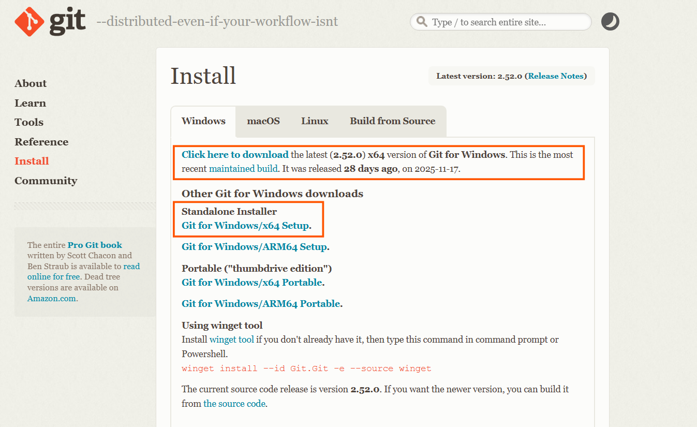

#### **Step 2: Launch the Installer**  
- Locate the downloaded installer and double-click to run it.  
- If prompted by **User Account Control**, click **Yes** to allow changes.  


#### **Step 3: License Agreement**  
- Read the GNU General Public License.  
- Click **Next** to proceed.  


#### **Step 4: Select Destination Location**  
- Accept the default installation folder:  
   ```
   C:\Program Files\Git
   ```  
- Click **Next**.  

   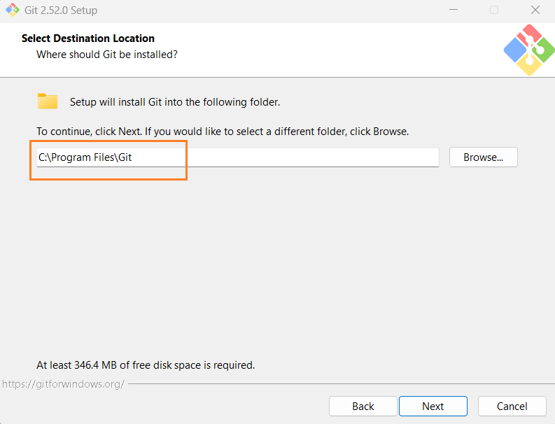


---

#### **Step 5: Select Components**  
- Choose the components to install (**recommended** selections by **default**):
  - [ ] Additional icons (optional)    
  - [x] **Windows Explorer integration**  
  - [x] **Git LFS (Large File Support)**  
  - [x] **Associate .git* configuration files with default text editor**  
  - [x] **Associate .sh files with Bash**  
  - [ ] Check daily for updates (optional)  
  - [ ] Add a Git Bash Profile to Windows Terminal  
  - [x] **Scalar** (for large-scale repositories)  

- Click **Next**.  

   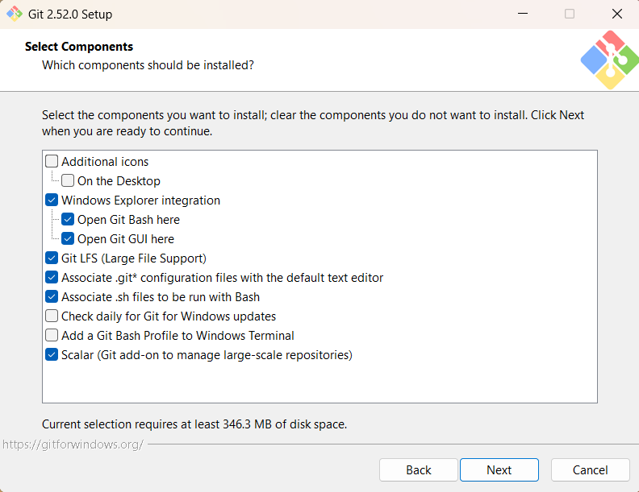


#### **Step 6: Start Menu Folder**  
- Accept the default Start Menu folder or choose **Don’t create a Start Menu folder**.
- I choose to default which create start menu folder.  
- Click **Next**.  

   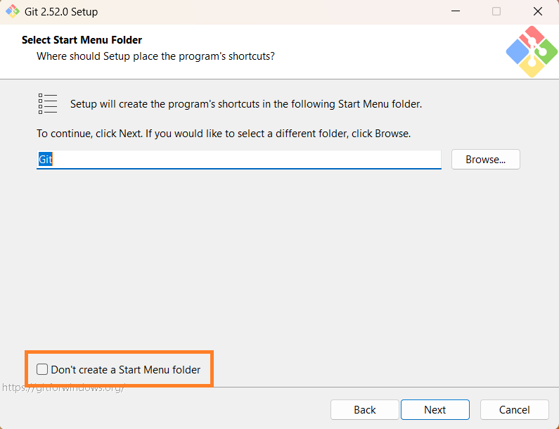


#### **Step 7: Choose Default Editor**  
- Select **Use Visual Studio Code as Git’s default editor** (recommended).  
- Click **Next**.  
   
   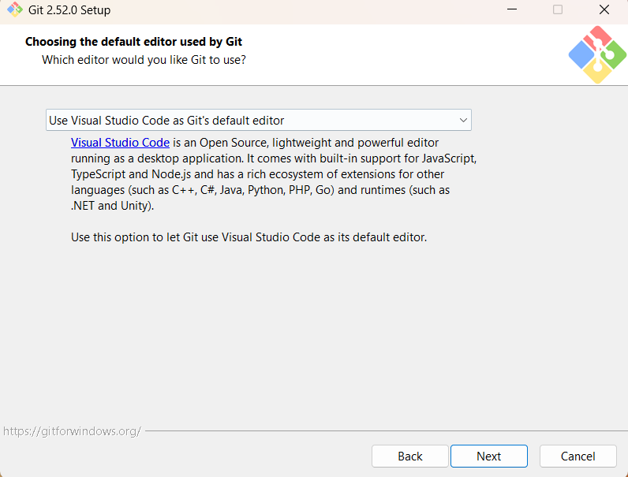


#### **Step 8: Adjust Initial Branch Name**  
- Select **Override the default branch name for new repositories**.  
- Enter **`main`** as the default branch name (recommended).  
- Click **Next**.  

   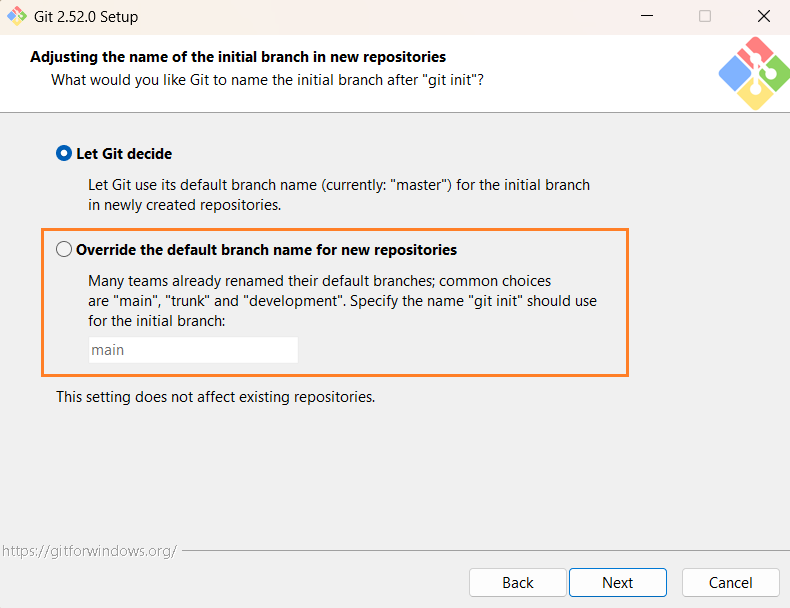


#### **Step 9: Adjust PATH Environment**  
- Select:  
  - [x] **Git from the command line and also from 3rd-party software** (Recommended)  
  
- Click **Next**.  
   
   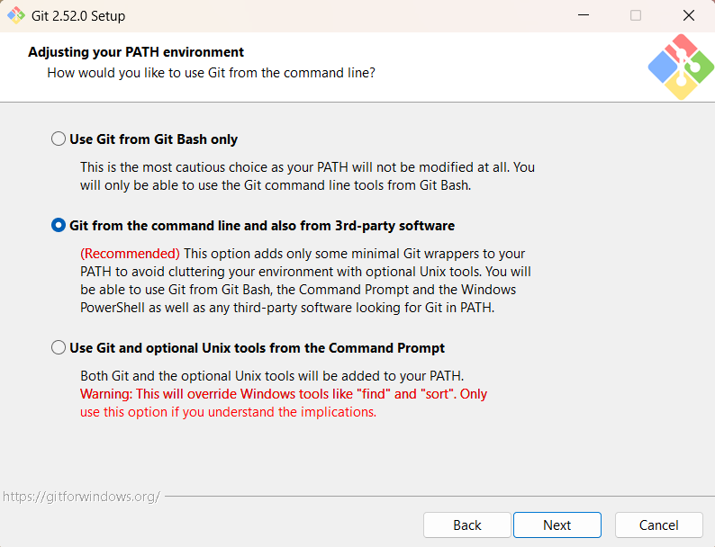


#### **Step 10: Choose SSH Executable**  
- Select **Use bundled OpenSSH** (default).  
- Click **Next**.

   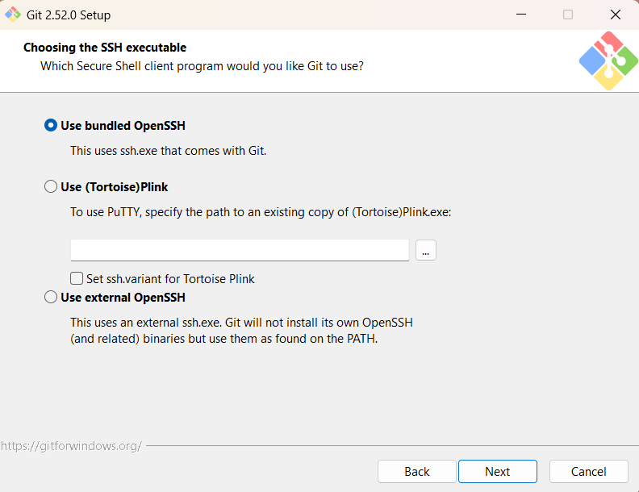


#### **Step 11: Choose HTTPS Transport Backend**  
- Select:  
  - [x] **Use the OpenSSL library** (default).  

- Click **Next**.  

   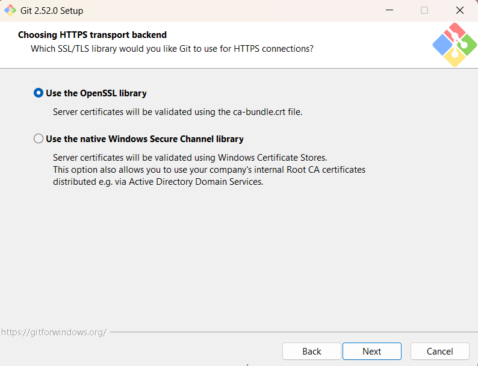


#### **Step 12: Configure Line Ending Conversions**  
- Select:  
  - [x] **Checkout Windows-style, commit Unix-style line endings** (recommended for cross-platform work).  

- Click **Next**.  

   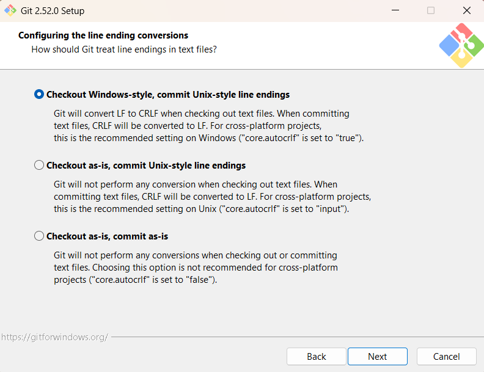


#### **Step 13: Choose Terminal Emulator**  
- Select:  
  - [x] **Use MinTTY** (recommended for better terminal experience).  

- Click **Next**.  

   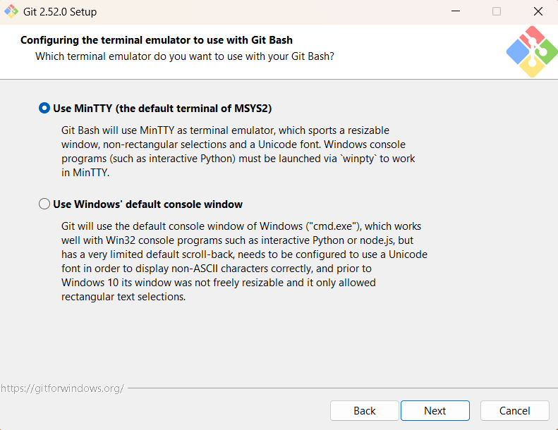


#### **Step 14: Configure `git pull` Behavior**  
- Select:  
  - [x] **Fast-forward or merge** (default and recommended).  

- Click **Next**.  

   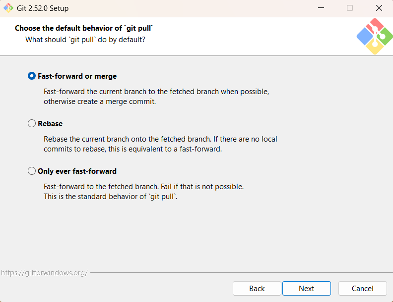


#### **Step 15: Choose Credential Helper**  
- Select Git credential manager (recommended for secure credential storage):  
  - [x] **Git Credential Manager**

- Click **Next**.  

   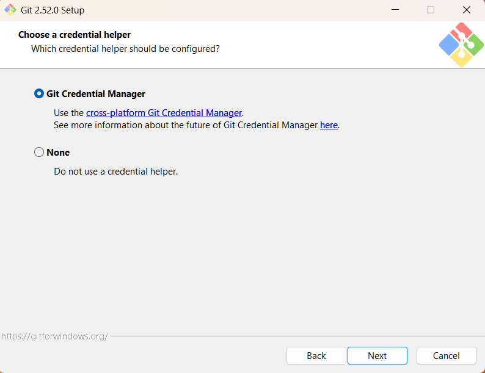


#### **Step 16: Configure Extra Options**  
- Enable:  
  - [x] **Enable file system caching** (performance boost)  
  - [ ] **Enable symbolic links** (if supported by your system)  

- Click **Next**.
- 
   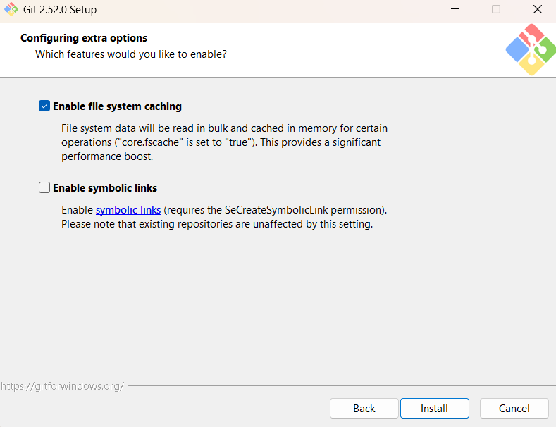


#### **Step 17: Begin Installation**  
1. Review settings.  
2. Click **Install**.  
3. Wait for installation to complete (progress bar will show).  

   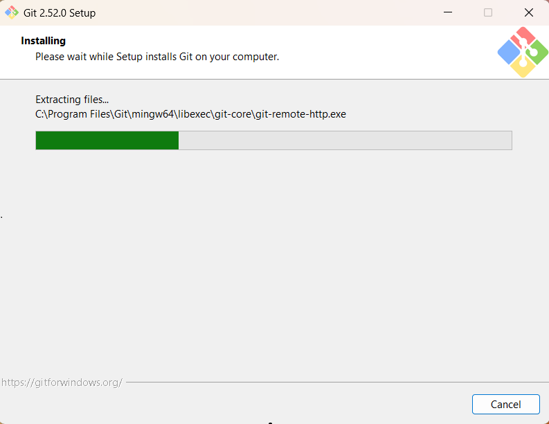


**Step 18: Finish Installation**  
- Once installation is complete, check **Launch Git Bash** if desired.  
- Click **Finish**.  

---

### **Verification**  
1. Open **Command Prompt** or **Git Bash**.  
2. Run the following command to verify installation:  
   ```bash
   git --version
   ```  
3. Expected output:  
   ```
   git version 2.52.0
   ```  

---

### **Post-Installation Configuration**  
- Set your Git username and email (required for commits):
    
   ```bash
   git config --global user.name "Your Name"
   git config --global user.email "your.email@example.com"
   ```  

---

### **Troubleshooting**  
- If `git` is not recognized in Command Prompt, restart your terminal or system.  
- Ensure the **Git installation directory** is added to the system PATH (Step 9).  
  

---

### **References**  
- Official Git Documentation: [https://git-scm.com/doc](https://git-scm.com/doc)  
- Git for Windows Releases: [https://gitforwindows.org/](https://gitforwindows.org/)  

---

**End of SOP**